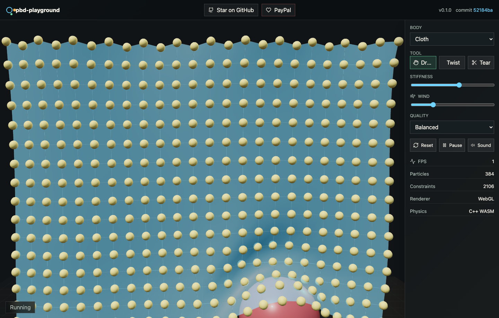
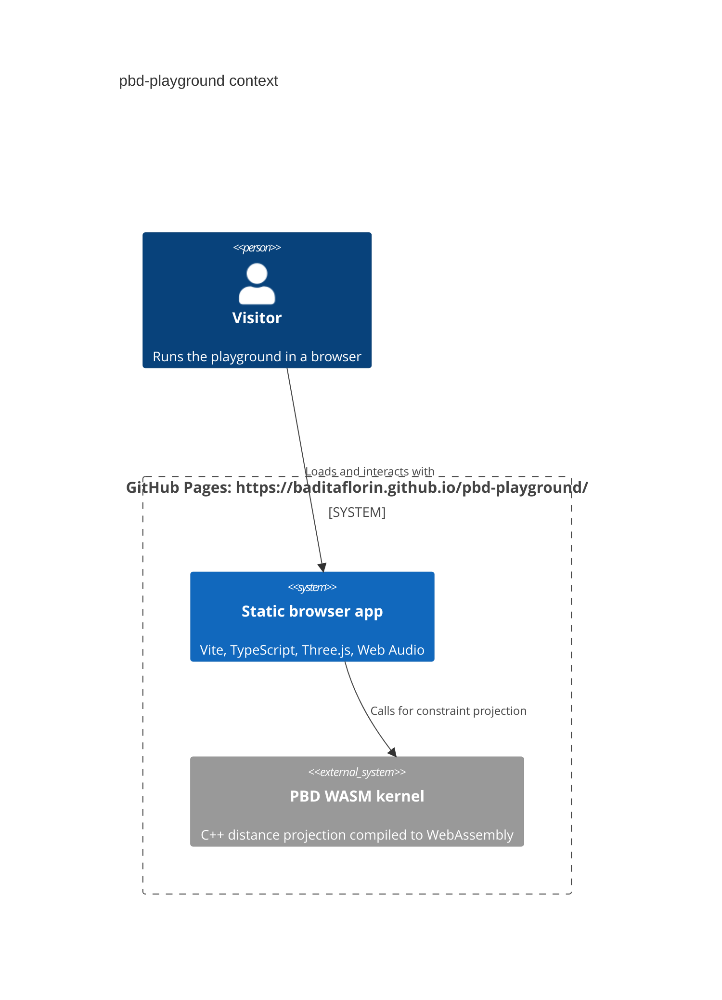

# pbd-playground


Live app: https://baditaflorin.github.io/pbd-playground/

Repository: https://github.com/baditaflorin/pbd-playground

PayPal: https://www.paypal.com/paypalme/florinbadita

`pbd-playground` is a tactile soft-body physics sandbox: cloth, jelly, ropes, and hair run in the browser with a C++ Position-Based Dynamics constraint kernel compiled to WASM, Three.js rendering with WebGPU/WebGL, and Web Audio collision tones.



## Quickstart

```bash
npm install
make install-hooks
make dev
make build
make smoke
```

## What Works

- Four real-time presets: cloth, jelly, rope, and hair.
- Drag, twist, and tear tools.
- Collision-triggered Web Audio.
- WebGPU renderer when available, WebGL fallback otherwise.
- C++ WASM distance-constraint solver with TypeScript fallback.
- Version and build commit shown on the live GitHub Pages UI.
- Offline-friendly service worker and web manifest.

## Architecture



Architecture details: docs/architecture.md

ADRs: docs/adr/

Deployment guide: docs/deploy.md

Privacy: docs/privacy.md

## Pages Build

`make build` compiles `public/wasm/pbd_kernel.wasm`, typechecks the app, and writes the GitHub Pages artifact to `docs/`. GitHub Pages serves `main` branch `/docs`.

The app base path is `/pbd-playground/`, so local Pages preview uses:

```bash
make pages-preview
```

## Notes

The v1 WASM module is a compact C++ PBD hot-loop kernel inspired by Müller-style Position-Based Dynamics. The module boundary is intentionally small so a larger upstream PositionBasedDynamics port can replace it later without changing the playground UI.
