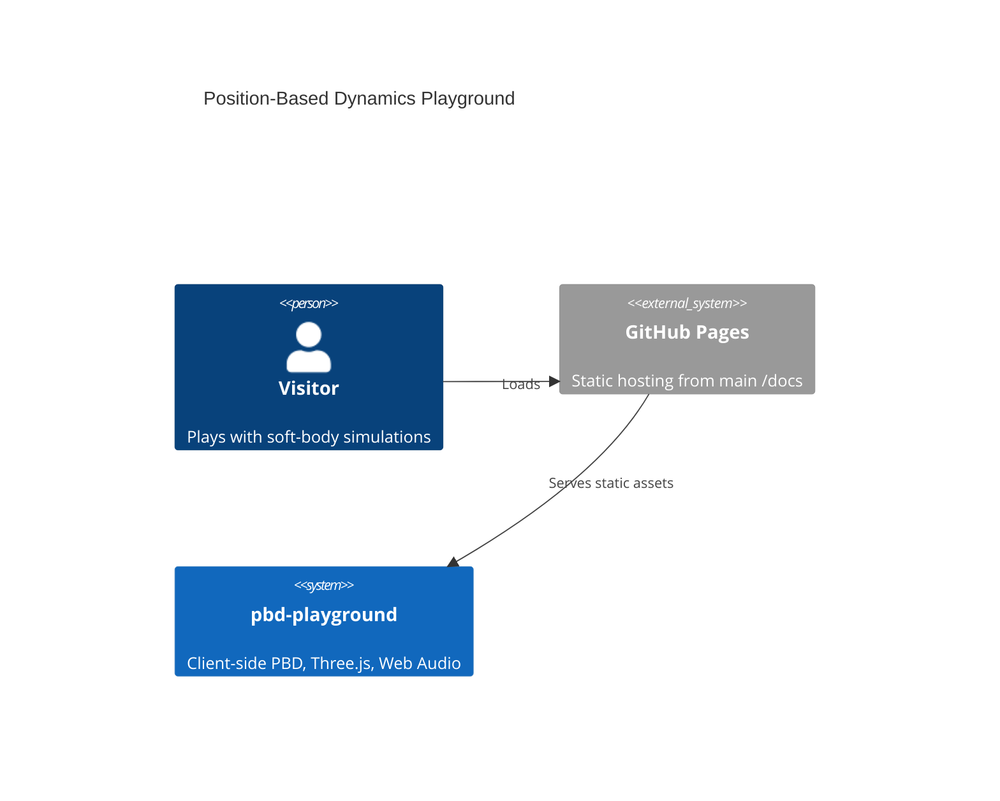
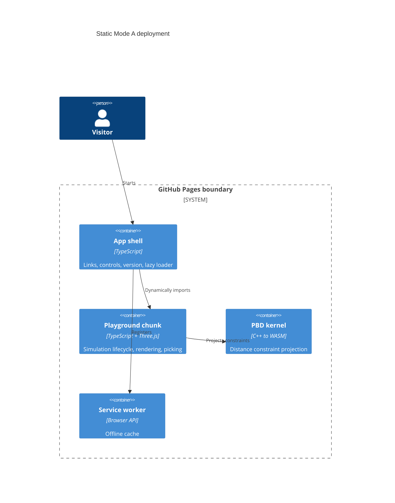

# Architecture

Live app: https://baditaflorin.github.io/pbd-playground/

Repository: https://github.com/baditaflorin/pbd-playground

## Context

## Container

## Module Boundaries

- `src/app` behavior lives in `src/main.ts`.
- `src/features/playground` owns UI-to-simulation orchestration.
- `src/features/physics` owns presets, solver state, constraints, and the WASM bridge.
- `src/features/rendering` owns Three.js renderer selection and scene updates.
- `src/features/audio` owns Web Audio collision synthesis.
- `wasm/pbd_kernel.cpp` is compiled into `public/wasm/pbd_kernel.wasm`.

## GitHub Pages Boundary

Everything under `docs/` is public static output or public documentation. No runtime backend, private token, database, Docker container, nginx config, or GitHub Actions workflow is required for v1.
